<picture>
  <source media="(prefers-color-scheme: dark)" srcset="./assets/header.svg">
  <source media="(prefers-color-scheme: light)" srcset="./assets/header-light.svg">
  
</picture>

### Hello Friends, I'm Fatih! 👋

<picture>
  <source media="(prefers-color-scheme: dark)" srcset="./assets/typing.svg">
  <source media="(prefers-color-scheme: light)" srcset="./assets/typing-light.svg">
  
</picture>

**Forward Deployed Engineer & Researcher**

*Engineer and researcher at the intersection of distributed systems, applied cryptography, and AI. Based in Bandung, Indonesia.*

Cybersecurity & Blockchain Enthusiast · Quantum Computing & Quant Finance Researcher

 

### `fatih@github ~ $ ./whoami.sh`

<table>
<tr>
<td valign="top" width="370">
<picture>
  <source media="(prefers-color-scheme: dark)" srcset="./assets/fatih-ascii.svg">
  <source media="(prefers-color-scheme: light)" srcset="./assets/fatih-ascii-light.svg">
  
</picture>
</td>
<td valign="top" width="490">
<picture>
  <source media="(prefers-color-scheme: dark)" srcset="./assets/info-card.svg">
  <source media="(prefers-color-scheme: light)" srcset="./assets/info-card-light.svg">
  
</picture>
</td>
</tr>
</table>

### `fatih@github ~ $ cat about.md`

I am an **Informatics Engineering** student (Summa Cum Laude track) at UIN Sunan Gunung Djati Bandung, with a **Bachelor of Computer Science** exchange at Universiti Utara Malaysia. I combine rigorous logical thinking with practical work in **low-level engineering** and **Web3 security**.

Forward Deployed Engineer solving end-to-end business problems with technology and AI. I have shipped production apps for SMEs and early-stage startups since 2024. First-author research in post-quantum cryptography for high-throughput blockchains and in blockchain supply-chain traceability (gold medal, ICYMS 2026). Grant-funded Stellar open-source contributor (SCF Instaward, Sep 2026) and Stellar Ambassador, with build experience on Solana and Base. Security practice covers ISO 27001 and SOC 2 audit support, penetration testing, and smart-contract review.

#### Current Status

- 🎓 **Education:** Informatics Engineering at UIN Sunan Gunung Djati Bandung (Summa Cum Laude track) and a B.CS exchange at Universiti Utara Malaysia.
- 🛡️ **Focus:** Cybersecurity, quant finance, and quantum machine learning, plus applied cryptography and AI.
- ⛓️ **Blockchain Stack:** Solidity, Rust, Hardhat, Foundry, Soroban, Solana, and Base.
- 💻 **Core Engineering:** Python, Java, Next.js, and TypeScript.
- 👨‍🏫 **Activity:** Mentoring in algorithms and open source. Stellar Ambassador, and lead of Superteam Campus Club UIN Bandung.
- 💼 **Now:** Forward Deployed Engineer and Product Owner at Daemon Protocol (Apr 2026–now). Project Manager Intern at Ibunda.id (Oct 2026–Apr 2027).

### `fatih@github ~ $ ./contributions.sh`

<picture>
  <source media="(prefers-color-scheme: dark)" srcset="./assets/contrib-heatmap.svg">
  <source media="(prefers-color-scheme: light)" srcset="./assets/contrib-heatmap-light.svg">
  
</picture>

 

<picture>
  <source media="(prefers-color-scheme: dark)" srcset="./assets/snake.svg">
  <source media="(prefers-color-scheme: light)" srcset="./assets/snake-light.svg">
  
</picture>

### `fatih@github ~ $ ./projects.sh`

#### Featured

**[Evergreen](https://github.com/Fatihmaull/evergreen)** · [Live](https://evergreen-stellar.pages.dev/) · [Repo](https://github.com/Fatihmaull/evergreen)

Open-source Soroban TTL and state-archival automation. Stellar Community Fund Instaward.

**[HalalChain](https://github.com/Fatihmaull/halal-chain)** · [Live](https://halal-chain-tawny.vercel.app/) · [Repo](https://github.com/Fatihmaull/halal-chain)

Trustless halal batch traceability on Base L2. First-author paper. Gold medal, ICYMS 2026.

**[ARES](https://github.com/Fatihmaull/ARES)** · [Live](https://aressystem.dev/) · [Repo](https://github.com/Fatihmaull/ARES)

Agentic AI for Solana smart-contract vulnerability detection. Daemon Protocol.

**[Parity](https://github.com/Fatihmaull/parity)** · [Live](https://parity-khaki-pi.vercel.app/) · [Repo](https://github.com/Fatihmaull/parity)

Every PreStock on Solana, priced correctly. Stocklana hackathon, PreStocks bounty.

**[FOCU Studio](http://focustudio.online/id)** · [Live](http://focustudio.online/id)

Web agency. CI/CD with Cloudflare Tunnel and GitHub Actions.

#### Also shipping

**[Kivo](https://github.com/Fatihmaull/kivo-on-stellar)** · [Live](https://kivo-on-stellar.vercel.app) · [Repo](https://github.com/Fatihmaull/kivo-on-stellar)

Non-custodial Stellar smart-account wallet. Device passkeys instead of seed phrases, with on-chain social recovery.

**[Pokertunity](https://github.com/Fatihmaull/pokertunity)** · [Live](https://pokertunity-production.up.railway.app) · [Repo](https://github.com/Fatihmaull/pokertunity)

An arena where poker agents play No-Limit Hold'em on EVM testnets.

**[Quorum](https://github.com/Fatihmaull/zcash-multisig)** · [Repo](https://github.com/Fatihmaull/zcash-multisig)

Threshold custody for Zcash shielded funds, built on FROST.

**[APEX](https://github.com/Fatihmaull/apex-on-stellar)** · [Live](https://apex-on-stellar.vercel.app) · [Repo](https://github.com/Fatihmaull/apex-on-stellar)

Cash-settled GPU compute futures on Stellar (Soroban). Testnet software.

**[Parkir BPM](https://github.com/Fatihmaull/parkir-bpm)** · [Repo](https://github.com/Fatihmaull/parkir-bpm)

Offline-first, multi-tenant smart gate and parking system in Go.

**[Auditorum](https://github.com/Fatihmaull/auditorum)** · [Live](https://auditorum-inky.vercel.app) · [Repo](https://github.com/Fatihmaull/auditorum)

Solana wallet access control and document intelligence for corporate audit reports.

**[Nemesis Protocol](https://nemesis-protocol.vercel.app/)** · [Live](https://nemesis-protocol.vercel.app/)

Productive EV infrastructure DePIN.

#### Research

**[CRYSTALS-Dilithium vs Ed25519 for Solana](https://github.com/Fatihmaull/crystal-dillithium)** · [Repo](https://github.com/Fatihmaull/crystal-dillithium)

Post-quantum signatures for Solana. Submitted to Blockchain Kaigi 2026.

**[High-Energy Physics Event Classification](https://github.com/Fatihmaull/higgsboson-detection)** · [Repo](https://github.com/Fatihmaull/higgsboson-detection)

Hybrid quantum-classical algorithms (Qiskit) for the ATLAS Higgs Boson Challenge, at **56.2% accuracy** with depth-2 circuits.

**[Bitcoin Market Efficiency](https://github.com/Fatihmaull/bitcointrenanalysis)** · [Repo](https://github.com/Fatihmaull/bitcointrenanalysis)

Demonstrated the inefficacy of standard technical indicators on BTC/USD using a custom Python backtesting engine and ROC/AUC analysis.

#### Cybersecurity & Engineering

**National Student Election System**

Saved a critical national voting project by migrating to a **serverless Google Apps Script** architecture 24 hours before launch, with **zero fraud**.

**E-Commerce Penetration Testing**

Identified critical XSS and IDOR vulnerabilities with **Burp Suite** and wrote CVSS-based remediation reports.

### `fatih@github ~ $ ls ~/stack`

**🌐 Web3 & Blockchain**

**💻 Core Languages & Quant**

**🚀 Web Development**

**🔧 Tools, Security & OS**

More tools

 

**Web3**

**Languages & quant**

**Web**

**Security, ops & writing**

**Cloud & hosting**

**GRC**

**Design & PM**

 

### `fatih@github ~ $ ./stats.sh`

<table>
<tr>
<td valign="top">

</td>
<td valign="top">

</td>
</tr>
</table>

 

<picture>
  <source media="(prefers-color-scheme: dark)" srcset="./assets/stats.svg">
  <source media="(prefers-color-scheme: light)" srcset="./assets/stats-light.svg">
  
</picture>

 

### `fatih@github ~ $ cat achievements.txt`

<picture>
  <source media="(prefers-color-scheme: dark)" srcset="./assets/trophies.svg">
  <source media="(prefers-color-scheme: light)" srcset="./assets/trophies-light.svg">
  
</picture>

- 🥇 **Gold medal, ICYMS 2026** — HalalChain.
- 💰 **Stellar Community Fund Instaward**, Sep 2026 — Evergreen. USD 4,800 in XLM.
- 🌟 **Stellar Ambassador**, Aug 2026–now.
- 📄 **First author** — post-quantum cryptography for Solana (submitted to Blockchain Kaigi 2026) and HalalChain supply-chain traceability.

The card above also shows GitHub's own achievements (Pair Extraordinaire, Pull Shark, YOLO, Quickdraw) plus live contribution, follower, and repository counts. Those numbers are regenerated from the public profile.

### `fatih@github ~ $ ./links.sh`

 

 

